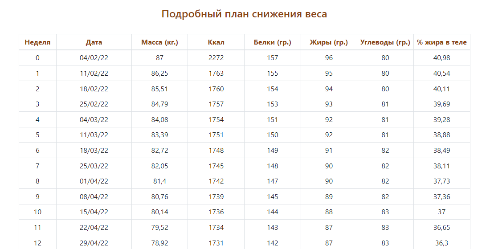
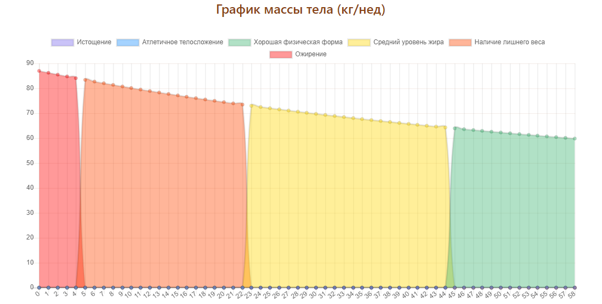

# Web-приложение на ASP.NET Core

[](https://learn.microsoft.com/aspnet/core/)
[](https://www.docker.com/)
[](https://www.nginx.com/)
[](https://docs.docker.com/compose/)


## Описание проекта

Сайт [HealthyWeight.ru](https://healthyweight.ru/) представляет собой онлайн-платформу, ориентированную на здоровое снижение веса и поддержание оптимальной массы тела. Он предлагает пользователям инструменты для расчёта нормального веса, составления индивидуальных планов снижения массы и повышения осведомлённости о метаболизме.​

🧭 Основные разделы сайта:
Калькулятор нормы: помогает определить нормальный вес с учётом процента жира в организме.

План снижения веса: предлагает персонализированные рекомендации для безопасного и эффективного снижения массы тела.

Метаболизм: предоставляет информацию о факторах, влияющих на обмен веществ, и советы по его ускорению.​

🌱 Цель и подход:
Сайт ориентирован на тех, кто стремится к постепенному и здоровому снижению веса без экстремальных диет и ограничений. Он предоставляет информацию и инструменты, способствующие осознанному подходу к питанию и физической активности.​

### Форма ввода показателей.


### Табличные результаты составленного плана снижения веса
Нулевая неделя - ваша норма КБЖУ для поддержания веса в текущем состоянии
Все последующие недели с новой нормой КБЖУ для "безопасного" снижения веса, который не приведет к нарушению обмена веществ и срывам.


### Визуализация результатов
Различными цветами обозначаются границы нахождения в той или иной зоне телосложения.


## 🚀 Инструкция по запуску

1. **Склонируйте репозиторий**:

    ```bash
    git clone https://github.com/DoNatPanic/BodyCoreProduct.git
    ```
2. **Установите .NET SDK**
    - перейдите на сайт https://dotnet.microsoft.com/ru-ru/download/dotnet
    - Скачайте версию 9.0 для нужной платформы

3. **Запустите в Visual Studio Code**:
    - Откройте проект
    - Запустите команду для сборки и запуска
        ```
        dotnet run
        ```

