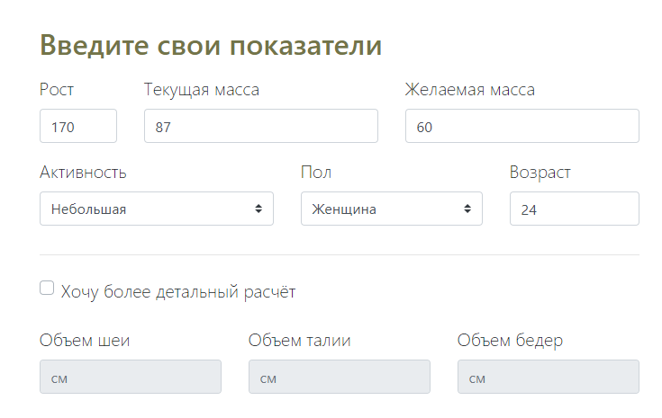

## 🚀 Инструкция по запуску

1. **Склонируйте репозиторий**:

    ```bash
    git clone https://github.com/DoNatPanic/BodyCoreProduct.git
    ```
2. **Установите .NET SDK**
    - перейдите на сайт https://dotnet.microsoft.com/ru-ru/download/dotnet
    - Скачайте версию 9.0 для нужной платформы

3. **Запустите в Visual Studio Code**:
    - Откройте проект
    - Запустите команду для сборки и запуска
        ```
        dotnet run
        ```

### Для чего это приложение? 

1) определить процент жировой ткани в организме;
2) составить комфортный для организма план снижения веса.

### Форма ввода показателей.



### Табличные результаты составленного плана снижения веса
Нулевая неделя - ваша норма КБЖУ для поддержания веса в текущем состоянии
Все последующие недели с новой нормой КБЖУ для "безопасного" снижения веса, который не приведет к нарушению обмена веществ и срывам.


### Визуализация результатов
Различными цветами обозначаются границы нахождения в той или иной зоне телосложения.

